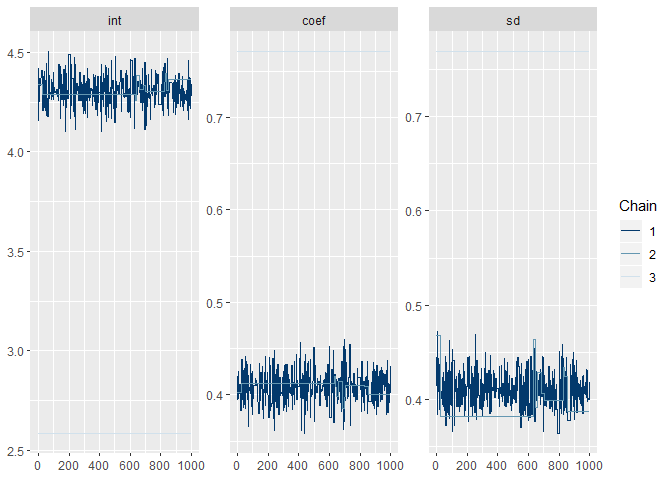

R Markdown
----------

This is an R Markdown document. Markdown is a simple formatting syntax for authoring HTML, PDF, and MS Word documents. For more details on using R Markdown see <http://rmarkdown.rstudio.com>.

When you click the **Knit** button a document will be generated that includes both content as well as the output of any embedded R code chunks within the document. You can embed an R code chunk like this:

``` r
library(greta)
```

    ## 
    ## Attaching package: 'greta'

    ## The following objects are masked from 'package:stats':
    ## 
    ##     binomial, poisson

    ## The following objects are masked from 'package:base':
    ## 
    ##     %*%, backsolve, beta, colMeans, colSums, diag, forwardsolve,
    ##     gamma, rowMeans, rowSums, sweep

``` r
x <- iris$Petal.Length
y <- iris$Sepal.Length
plot(x,y)
```


``` r
int <- normal(0, 5)
coef <- normal(0, 3)
sd <- lognormal(0, 3)

mean <- int + coef * x
distribution(y) <- normal(mean, sd)
m <- model(int, coef, sd)
plot(m)
```

    ## Warning: package 'bindrcpp' was built under R version 3.4.4

``` r
draws <- mcmc(m, n_samples = 1000, chains = 3)
```

    ## 
    ## chain 1/3

    ## 
    ## chain 2/3

    ## 
    ## chain 3/3

``` r
bayesplot::mcmc_trace(draws)
```



Including Plots
---------------

You can also embed plots, for example:


Note that the `echo = FALSE` parameter was added to the code chunk to prevent printing of the R code that generated the plot.
